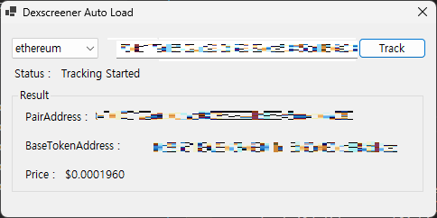

# Dex_DataLoad

This project uses the 'DexScreen API'

<div align='center'>

</div>

0. **Code Compile**  

```bash
dotnet publish --configuration Release
```

```bash
bin/Release/netx.0/publish/xxx.exe
```

1. **Timer Set**
   - Edit -> 'Dex_DataLoad.cs' File Open.
   - 32Lines -> **System.Timers.Timer\(xx\)\;** -> 'xx' Edit (1000 = 1sec) -> Save
   - Run and Rebuild ('dotnet publish' command)

\* official Docs : 
Check orders paid for of token (rate-limit 60 requests per minute)

<br>

**The API data is officially provided by Dexscreener but may still differ; please verify independently.**